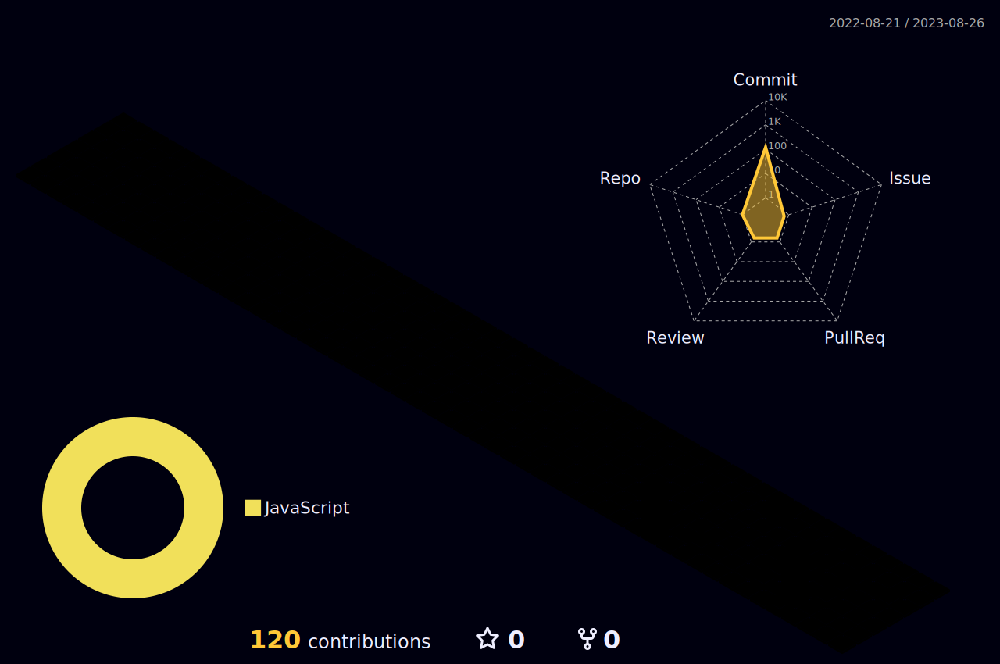

  
## 👋Welcome to Arshia's kingdom 👋

[Backend]  

 
[Frontend] 

 
- 🔭 I’m currently working on web-development
- 🌱 I’m currently learning React, javascript, API
- 👯 I’m looking to collaborate on prjoects/AI
- 💬 Ask me about anything you want(:
- 📫 How to reach me: arshia.tey1@gmail.com

